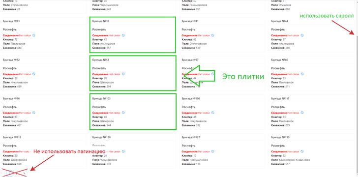

Приложение должно быть создано с помощью create-react-app, с использованием redux, rest API и написано на typescript в функциональном стиле.
На время загрузки данных должен отображаться прелоадер. Если сервер с данными недоступен, должно выводиться предупреждающее сообщение.
Приложение должно быть адаптировано как в десктопной, так и в мобильной версии браузера.

На первой странице:
Внешний вид страницы состоит из фильтра состояния соединения, департаментов и «плиток» (плитки выделены зелёным) бригад. Вёрстка должна быть выполнена с использованием библиотеки https://ant.design/. Пример странички: https://v1336-test-task.vercel.app/. В плитках бригады вместо пагинации нужно использовать скролл. Количество плиток в окне браузера должно быть максимальным, но информация в плитках не должна теряться и искажаться.

На второй странице:
Должен быть график и элементы ввода кол-ва точек и загрузки точек (использовать ant.design). Построить график используя библиотеку «highcharts» https://www.highcharts.com/, тип графика { type: 'line', step: 'left' },

Данные забираются методами: 
https://v1336-api-test.onrender.com/getBrigadesData - получение бригад с данными
https://v1336-api-test.onrender.com/getDepartments - получение департаментов
https://v1336-api-test.onrender.com/getConnectionState - получение статусов подключения
https://v1336-api-test.onrender.com/getPointsFast?points=1000 — получение точек(points — кол-во точек от 1 до 1000000).

Выложить проект на Git для ознакомления с кодом.
Разместить проект на любой удобный хостинг для демонстрации.
